<h1 align="center">Hi 👋, I'm VIJAY PANDEY</h1>
<h3 align="center">SOFTWARE DEVLOPER</h3>

  

    ## 🧠 My Focus Areas
- web development
- cyber security

 

## 📊 GitHub Stats & Trophies

  

  ## Streak
  

  

</a>

  

## 🛠️ Languages & Tools

<h3 align="center">Programming Languages</h3>

  &nbsp;&nbsp;
  

<h3 align="center">Frontend</h3>

  &nbsp;&nbsp;
  &nbsp;&nbsp;
  &nbsp;&nbsp;
  

<h3 align="center">Backend</h3>

  &nbsp;&nbsp;
  

<h3 align="center">Database</h3>

  &nbsp;&nbsp;
  

<h3 align="center">DevOps & Cloud</h3>

  &nbsp;&nbsp;
  

<h3 align="center">Tools</h3>

  &nbsp;&nbsp;
  &nbsp;&nbsp;
  

  

 

## 🔗 Connect with Me

  &nbsp;&nbsp;
  

  

  

